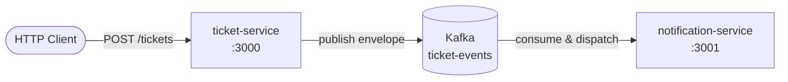

# Ticket Platform

A NestJS monorepo for a ticket management platform built around event-driven communication. Services communicate asynchronously through Apache Kafka, using a shared event envelope format and reusable libraries for messaging and domain events.

## Overview

The platform is split into independent services that share contracts through shared libraries:

| Service | Port | Role |
|---------|------|------|
| **ticket-service** | `3000` | REST API for ticket operations; publishes domain events to Kafka |
| **notification-service** | `3001` | Consumes ticket events and triggers notification workflows |

Both services use the shared `@app/kafka` library for producing and consuming messages, and `@app/events` for typed event contracts.

## Architecture



### Event flow

1. A client sends a request to **ticket-service** (e.g. create a ticket).
2. **ticket-service** publishes a typed event envelope to the `ticket-events` Kafka topic.
3. **notification-service** consumes the message, routes it by `type`, and runs the matching handler.

### Event envelope

All ticket events share a common envelope published to `ticket-events`:

```json
{
  "type": "TicketCreated",
  "eventId": "uuid",
  "ticketId": "uuid",
  "occurredAt": "2026-07-12T18:00:00.000Z",
  "payload": { }
}
```

Supported event types:

| Type | Status | Description |
|------|--------|-------------|
| `TicketCreated` | Implemented | A new ticket was created |
| `TicketAssigned` | Contract only | A ticket was assigned to a user |
| `TicketResolved` | Contract only | A ticket was resolved |
| `TicketClosed` | Contract only | A ticket was closed |

Payload shapes for each type live in `libs/events/src/ticket/`.

## Project structure

```
ticket-platform/
├── apps/
│   ├── ticket-service/          # Ticket REST API + Kafka producer
│   └── notification-service/    # Kafka consumer + event handlers
├── libs/
│   ├── common/                  # Shared NestJS utilities
│   ├── events/                  # Domain event types and envelopes
│   └── kafka/                   # Kafka producer/consumer module (kafkajs)
├── nest-cli.json
└── package.json
```

### Shared libraries

#### `@app/events`

Domain event contracts shared across services:

- `TicketEventEnvelope` — wrapper for all ticket events
- `TICKET_EVENT_TYPES` — event type constants
- Per-event payload interfaces (`TicketCreatedPayload`, etc.)

#### `@app/kafka`

Reusable Kafka integration built on [KafkaJS](https://kafka.js.org/):

- `KafkaModule.register(options)` — dynamic module configuration
- `KafkaProducerService` — non-blocking producer with automatic reconnect
- `KafkaConsumerService` — consumer with subscription queuing and reconnect
- `KAFKA_TOPICS` — topic name constants

**Module registration**

```typescript
// Producer only (ticket-service)
KafkaModule.register({
  clientId: 'ticket-service',
  brokers: ['localhost:9092'],
})

// Producer + consumer (notification-service)
KafkaModule.register({
  clientId: 'notification-service',
  brokers: ['localhost:9092'],
  groupId: 'notification-group',
})
```

The consumer is only registered when `groupId` is provided.

## Prerequisites

- Node.js 18+
- npm
- Apache Kafka running locally on `localhost:9092`

### Start Kafka locally

From your Kafka installation directory:

```bash
bin/kafka-server-start.sh config/server.properties
```

Create the topic (if it does not exist):

```bash
bin/kafka-topics.sh --create \
  --bootstrap-server localhost:9092 \
  --topic ticket-events \
  --partitions 1 \
  --replication-factor 1
```

Optional — watch messages on the topic:

```bash
bin/kafka-console-consumer.sh \
  --bootstrap-server localhost:9092 \
  --topic ticket-events \
  --from-beginning
```

## Getting started

```bash
# Install dependencies
npm install

# Start ticket-service (terminal 1)
npm run start:dev ticket-service

# Start notification-service (terminal 2)
npm run start:dev notification-service
```

## API

### Create a ticket

```bash
curl -X POST http://localhost:3000/tickets \
  -H "Content-Type: application/json" \
  -d '{
    "title": "Learning Kafka",
    "description": "Exploring event-driven architecture",
    "priority": "high"
  }'
```

**Response**

```json
{
  "message": "Ticket created successfully",
  "eventId": "uuid",
  "ticketId": "uuid"
}
```

**Expected notification-service logs**

```
[TicketEventDispatcher] Consumed event from Kafka | type=TicketCreated eventId=... ticketId=...
[TicketCreatedHandler] Sending "ticket created" notification | ticketId=... title="Learning Kafka" ...
```

## Notification service handlers

Event routing is handled by `TicketEventDispatcher`, which delegates to dedicated handlers:

```
apps/notification-service/src/handlers/
├── ticket-created.handler.ts
├── ticket-assigned.handler.ts
├── ticket-resolved.handler.ts
├── ticket-closed.handler.ts
└── ticket-event.dispatcher.ts
```

When ticket-service begins publishing `TicketAssigned`, `TicketResolved`, or `TicketClosed` events, notification-service will route them automatically — no dispatcher changes required.

## Development

```bash
# Build a specific service
npx nest build ticket-service
npx nest build notification-service

# Lint
npm run lint

# Unit tests
npm run test

# Format
npm run format
```

### Path aliases

| Alias | Path |
|-------|------|
| `@app/common` | `libs/common/src` |
| `@app/events` | `libs/events/src` |
| `@app/kafka` | `libs/kafka/src` |

## Current status

**Implemented**

- NestJS monorepo with `ticket-service` and `notification-service`
- Shared Kafka library with resilient producer/consumer (non-blocking connect, retry)
- Event envelope pattern with typed payloads
- `POST /tickets` endpoint publishing `TicketCreated` events
- Notification service consuming and dispatching events by type

**Planned**

- `TicketAssigned`, `TicketResolved`, `TicketClosed` API endpoints in ticket-service
- Real notification channels (email, push, etc.)
- Environment-based Kafka configuration
- Docker Compose for local Kafka

## License

UNLICENSED — private project.
